# Betty AI Assistant - Architecture Documentation

## Overview

Betty is an AI-powered assistant designed for Molex Manufacturing, providing intelligent responses using Retrieval-Augmented Generation (RAG) with the Outcome-Based Transformation (OBT) methodology and GPS (Global Product Development) framework.

**Key Technologies:**
- Frontend: Streamlit (Python)
- AI Provider: Anthropic Claude Sonnet 4.5
- Vector Database: ChromaDB
- Embeddings: SentenceTransformer (all-mpnet-base-v2)
- Storage: SQLite (feedback), ChromaDB (knowledge base)
- Web Search: Perplexity AI (primary), Tavily, Serper, Brave (fallbacks)

---

## 1. System Context Diagram

```mermaid
graph TB
    User[👤 User/Developer]
    Admin[👤 Admin User]

    Betty[Betty AI Assistant<br/>Streamlit Application]

    Claude[Anthropic Claude API<br/>Sonnet 4.5]
    Cassidy[Cassidy AI API<br/>Optional]
    OpenAI[OpenAI API<br/>Fallback]

    ChromaDB[(ChromaDB<br/>Vector Store)]
    FeedbackDB[(SQLite<br/>Feedback Database)]
    Docs[📁 Knowledge Base<br/>Docs Folder]

    WebSearch[Web Search Providers<br/>Perplexity, Tavily, Serper, Brave]

    User -->|Queries| Betty
    Admin -->|Analytics| Betty

    Betty -->|Embeddings & Search| ChromaDB
    Betty -->|Store Feedback| FeedbackDB
    Betty -->|Read Documents| Docs

    Betty -->|API Calls| Claude
    Betty -.->|Optional| Cassidy
    Betty -.->|Fallback| OpenAI
    Betty -->|Web Search| WebSearch

    style Betty fill:#4A90E2,stroke:#2E5C8A,color:#fff
    style User fill:#95E1D3,stroke:#38A89D
    style Admin fill:#F38181,stroke:#AA5042
    style ChromaDB fill:#F8B500,stroke:#C79100
    style FeedbackDB fill:#F8B500,stroke:#C79100
    style WebSearch fill:#9B59B6,stroke:#7D3C98
```



---

## 2. High-Level Architecture

```mermaid
graph TB
    subgraph "Presentation Layer"
        UI[Streamlit UI<br/>betty_app.py]
        Admin[Admin Dashboard<br/>admin_dashboard.py]
        Helper[UI Helpers<br/>clipboard_helper.py]
    end

    subgraph "Application Layer"
        Config[Configuration<br/>AppConfig]
        ChatLogic[Chat Logic<br/>MODE System]
        RAG[RAG Pipeline<br/>Multi-Pass Retrieval]
    end

    subgraph "Service Layer"
        VectorStore[Vector Store Service<br/>VectorStore]
        DocProcessor[Document Processor<br/>DocumentProcessor]
        FeedbackMgr[Feedback Manager<br/>FeedbackManager]
        CassidyClient[Cassidy Client<br/>CassidyClient]
        WebSearchTool[Web Search Tool<br/>WebSearchTool]
    end

    subgraph "Integration Layer"
        AnthropicAPI[Anthropic Claude API]
        OpenAIAPI[OpenAI API]
        CassidyAPI[Cassidy API]
        PerplexityAPI[Perplexity AI API]
        TavilyAPI[Tavily API]
        SerperAPI[Serper API]
        BraveAPI[Brave Search API]
    end

    subgraph "Data Layer"
        ChromaDB[(ChromaDB<br/>Vector Database)]
        SQLite[(SQLite<br/>Feedback DB)]
        FileSystem[📁 Document Storage]
    end

    UI --> ChatLogic
    UI --> Helper
    Admin --> FeedbackMgr

    ChatLogic --> RAG
    ChatLogic --> Config

    RAG --> VectorStore
    RAG --> AnthropicAPI

    VectorStore --> DocProcessor
    VectorStore --> ChromaDB

    DocProcessor --> FileSystem
    FeedbackMgr --> SQLite

    ChatLogic -.-> OpenAIAPI
    ChatLogic -.-> CassidyClient
    CassidyClient -.-> CassidyAPI

    ChatLogic --> WebSearchTool
    WebSearchTool --> PerplexityAPI
    WebSearchTool -.-> TavilyAPI
    WebSearchTool -.-> SerperAPI
    WebSearchTool -.-> BraveAPI

    style UI fill:#4A90E2,color:#fff
    style Admin fill:#4A90E2,color:#fff
    style ChromaDB fill:#F8B500,stroke:#C79100
    style SQLite fill:#F8B500,stroke:#C79100
    style WebSearchTool fill:#9B59B6,color:#fff
    style PerplexityAPI fill:#9B59B6,color:#fff
```



---

## 3. RAG Query Pipeline (Data Flow)


---

## 4. Web Search Pipeline (Tool Use)


### Web Search Provider Hierarchy


---

## 5. Document Ingestion Pipeline

```mermaid
graph LR
    Upload[📤 File Upload] --> Validate{Validate File}

    Validate -->|Valid| Extract[Text Extraction]
    Validate -->|Invalid| Error[❌ Error]

    Extract --> PDF[PDF Parser<br/>PyPDF2]
    Extract --> DOCX[DOCX Parser<br/>python-docx]
    Extract --> CSV[CSV Parser]
    Extract --> XLSX[XLSX Parser<br/>openpyxl]
    Extract --> TXT[TXT/MD Parser]
    Extract --> JSON[JSON Parser]

    PDF --> Clean[Text Cleaning]
    DOCX --> Clean
    CSV --> Clean
    XLSX --> Clean
    TXT --> Clean
    JSON --> Clean

    Clean --> Chunk[Chunking<br/>tiktoken<br/>1000 tokens, 200 overlap]

    Chunk --> Embed[Generate Embeddings<br/>SentenceTransformer<br/>768 dimensions]

    Embed --> Store[(Store in ChromaDB<br/>betty_knowledge)]

    Store --> Success[✅ Success]

    style Upload fill:#95E1D3
    style Success fill:#90EE90
    style Error fill:#F38181
    style Store fill:#F8B500
```



---

## 5. Component Architecture


---

## 6. MODE System (Response Strategy)


---

## 7. Multi-Pass Retrieval Strategy

```mermaid
graph TB
    Query[Complex Query Detected] --> Execute[Execute 6 Parallel Searches]

    Execute --> Q1[🔍 Change Control<br/>Management Projects<br/>5 results]
    Execute --> Q2[🔍 BOM PIM<br/>Management Projects<br/>5 results]
    Execute --> Q3[🔍 Requirements<br/>Management Projects<br/>5 results]
    Execute --> Q4[🔍 Data AI<br/>Projects<br/>5 results]
    Execute --> Q5[🔍 Design Management<br/>Collaboration Projects<br/>5 results]
    Execute --> Q6[🔍 Project Dependencies<br/>Impact Portfolio<br/>5 results]

    Q1 --> Collect[Collect Results<br/>30 total chunks]
    Q2 --> Collect
    Q3 --> Collect
    Q4 --> Collect
    Q5 --> Collect
    Q6 --> Collect

    Collect --> Dedupe[Deduplicate<br/>Hash first 100 chars]

    Dedupe --> Rank[Rank by Relevance<br/>Cosine Similarity]

    Rank --> Top[Return Top 25<br/>Unique Chunks]

    Top --> Context[Assemble Context<br/>for LLM]

    style Execute fill:#4A90E2,color:#fff
    style Dedupe fill:#FFE66D
    style Top fill:#90EE90
```



---

## 8. Deployment Architecture

### Cloud Deployment (Streamlit Cloud)


### Local Deployment

```mermaid
graph TB
    subgraph "Local Development Environment"
        LocalApp[Betty Application<br/>streamlit run betty_app.py]

        subgraph "Persistent Storage"
            ChromaLocal[(ChromaDB<br/>./chroma_db/)]
            FeedbackLocal[(SQLite<br/>./data/betty_feedback.db)]
            DocsLocal[📁 Knowledge Base<br/>./docs/]
        end

        subgraph "Configuration"
            EnvFile[.env File<br/>API Keys]
        end

        LocalApp --> ChromaLocal
        LocalApp --> FeedbackLocal
        LocalApp --> DocsLocal
        LocalApp --> EnvFile
    end

    subgraph "External Services"
        ClaudeAPI[Anthropic Claude API]
    end

    LocalApp --> ClaudeAPI

    LocalDev[💻 Local Developer] --> LocalApp

    style LocalApp fill:#4A90E2,color:#fff
    style ChromaLocal fill:#F8B500
    style FeedbackLocal fill:#F8B500
```



---

## 9. Database Schema

### ChromaDB Collections


### SQLite Feedback Database


---

## 10. Key Classes and Relationships


---

## 11. Knowledge Base Structure

```
docs/
├── Core OBT Framework
│   ├── OBT GPS Definitions.docx
│   ├── OBT and GPS Construction Rules.docx
│   └── Molex Manufacturing BA Reference Architecture.docx
│
└── Molex Master Dataset (50+ files)
    ├── 📂 Change Control Management (8 files)
    ├── 📂 BOM & PIM Management (12 files)
    ├── 📂 Requirements Management (6 files)
    ├── 📂 Design Management & Collaboration (10 files)
    ├── 📂 PD Framework Transformation (5 files)
    ├── 📂 Data & AI Strategy (8 files)
    ├── 📂 Global PD (7 files)
    └── 📂 GPS Framework
        └── 288 Outcomes across 13 Clusters
```

**Total Knowledge Base:**
- **53+ source files**
- **8 knowledge domains**
- **288 GPS outcomes** across 13 clusters
- **Vector Store:** ~2000+ embedded chunks

---

## 12. Performance Characteristics

| Metric | Value | Notes |
|--------|-------|-------|
| **Model Load Time** | 2-3s | SentenceTransformer (cached) |
| **Single-Pass Query** | 200-500ms | 15 results |
| **Multi-Pass Query** | ~960ms | 6 queries, 25 results, 11 files |
| **Claude Response** | ~3.9s | Average streaming response |
| **MODE 1 Response** | <1s | Ultra-concise (≤15 words) |
| **MODE 2 Response** | <1s | Classification (≤5 words) |
| **Web Search (Perplexity)** | ~2-3s | AI-powered with citations |
| **Web Search (Fallback)** | ~1-2s | Tavily/Serper/Brave |
| **Web Search Cache TTL** | 1 hour | In-memory result caching |
| **Memory Usage** | ~2GB | Models + vector database |
| **Disk Usage** | ~500MB | Vector DB + documents |

---

## 13. API Integration Details

### Anthropic Claude API

```python
# Configuration
Model: claude-sonnet-4-20250514
Temperature: 0.2  # Low for factual accuracy
Max Tokens: 4000
Top P: 0.9
Top K: 40
Streaming: Enabled

# Request Format
{
    "model": "claude-sonnet-4-20250514",
    "max_tokens": 4000,
    "temperature": 0.2,
    "messages": [...],
    "system": "<450+ line system prompt from system_prompt_v4.3.txt>"
}
```

### Cassidy AI API

```python
# Endpoints
Base URL: https://app.cassidyai.com/api

POST /assistants/thread/create
{
    "assistant_id": "cmgjq8s7802e1n70frp8qad4r"
}

POST /assistants/message/create
{
    "thread_id": "<thread_id>",
    "message": "<user_query>"
}
```

### Web Search APIs

```python
# Claude Tool Definition
WEB_SEARCH_TOOL_DEFINITION = {
    "name": "web_search",
    "description": "Search the web for current information...",
    "input_schema": {
        "type": "object",
        "properties": {
            "query": {"type": "string"},
            "max_results": {"type": "integer", "default": 5}
        },
        "required": ["query"]
    }
}

# Provider 1: Perplexity AI (Primary)
Base URL: https://api.perplexity.ai/chat/completions
Model: sonar
Features: AI-powered answers with citations
Timeout: 30s
{
    "model": "sonar",
    "messages": [...],
    "return_citations": true
}

# Provider 2: Tavily (Fallback 1)
Base URL: https://api.tavily.com/search
Features: Optimized for AI applications
Timeout: 10s
{
    "api_key": "<key>",
    "query": "<query>",
    "max_results": 5,
    "include_answer": true
}

# Provider 3: Serper (Fallback 2)
Base URL: https://google.serper.dev/search
Features: Google Search results
Timeout: 10s
Headers: {"X-API-KEY": "<key>"}
{
    "q": "<query>",
    "num": 5
}

# Provider 4: Brave Search (Fallback 3)
Base URL: https://api.search.brave.com/res/v1/web/search
Features: Privacy-focused search
Timeout: 10s
Headers: {"X-Subscription-Token": "<key>"}
Params: {"q": "<query>", "count": 5}
```

---

## 14. Security & Privacy


---

## 15. Future Architecture Considerations

### Potential Enhancements

1. **Scalability**
   - Migration to production vector DB (Pinecone, Weaviate)
   - Horizontal scaling with load balancer
   - Caching layer (Redis) for frequent queries

2. **Advanced RAG**
   - Hybrid search (semantic + keyword)
   - Re-ranking enabled (currently disabled)
   - Query decomposition for complex questions
   - Citation tracking improvements

3. **Authentication & Authorization**
   - OAuth integration
   - Role-based access control (RBAC)
   - Multi-tenant support

4. **Monitoring & Observability**
   - Application performance monitoring (APM)
   - Query analytics dashboard
   - Error tracking (Sentry)
   - Usage metrics (Prometheus/Grafana)

5. **Data Pipeline**
   - Automated document ingestion
   - Incremental updates (not full reindex)
   - Document versioning
   - Change detection

---

## Quick Reference

### Project Structure

```
betty_for_molex/
├── betty_app.py              # Main application (1,500+ lines)
├── config/
│   └── settings.py           # Configuration (122 lines)
├── utils/
│   ├── vector_store.py       # Vector operations (558 lines)
│   ├── document_processor.py # Document parsing (584 lines)
│   ├── feedback_manager.py   # Feedback system (264 lines)
│   ├── cassidy_client.py     # Cassidy integration (155 lines)
│   ├── clipboard_helper.py   # UI utilities (343 lines)
│   └── web_search.py         # Web search with fallbacks (362 lines)
├── pages/
│   └── admin_dashboard.py    # Analytics dashboard
├── docs/                     # Knowledge base (53+ files)
├── chroma_db/                # Vector database
├── data/
│   └── betty_feedback.db     # Feedback SQLite database
├── evaluation/               # Testing framework
└── system_prompt_v4.3.txt    # AI behavior config (450+ lines)
```

### Key Dependencies

```
anthropic>=0.39.0      # Claude API
streamlit>=1.41.1      # UI framework
chromadb>=0.5.0        # Vector database
sentence-transformers  # Embeddings
tiktoken              # Token counting
PyPDF2                # PDF processing
python-docx           # DOCX processing
openpyxl              # Excel processing
nltk                  # NLP utilities
plotly                # Visualization
pysqlite3-binary      # Cloud SQLite
requests              # Web search API calls
```

### Environment Variables (Web Search)

```
PERPLEXITY_API_KEY    # Primary web search provider
TAVILY_API_KEY        # Fallback 1 - AI-optimized search
SERPER_API_KEY        # Fallback 2 - Google Search API
BRAVE_API_KEY         # Fallback 3 - Privacy-focused search
```

---

## Conclusion

Betty's architecture follows a clean **layered design** with clear separation of concerns:

- **Presentation Layer:** Streamlit UI with modern chat interface
- **Application Layer:** RAG pipeline with MODE-based response strategy
- **Service Layer:** Reusable components (VectorStore, DocumentProcessor, FeedbackManager, WebSearchTool)
- **Integration Layer:** Claude API, Web Search APIs (Perplexity, Tavily, Serper, Brave)
- **Data Layer:** ChromaDB (knowledge), SQLite (feedback), File system (documents)

**Key Strengths:**
- ✅ Modular, maintainable codebase
- ✅ Cloud-ready deployment (Streamlit Cloud)
- ✅ Comprehensive RAG with multi-pass retrieval
- ✅ Built-in analytics and feedback loop
- ✅ MODE system for context-aware responses
- ✅ Extensive knowledge base (53+ files, 8 domains)
- ✅ Web search with multi-provider fallback chain
- ✅ Claude tool use integration for intelligent search decisions

**Design Patterns:**
- Singleton (global service instances)
- Strategy (multiple AI providers, file parsers, web search providers)
- Chain of Responsibility (web search provider fallback)
- Dependency Injection (AppConfig)
- Caching (ML models, embeddings, web search results)

This architecture supports Betty's mission to provide accurate, OBT-compliant responses while maintaining excellent performance and user experience. The web search capability extends Betty's knowledge beyond the internal knowledge base, enabling access to current information when needed.
